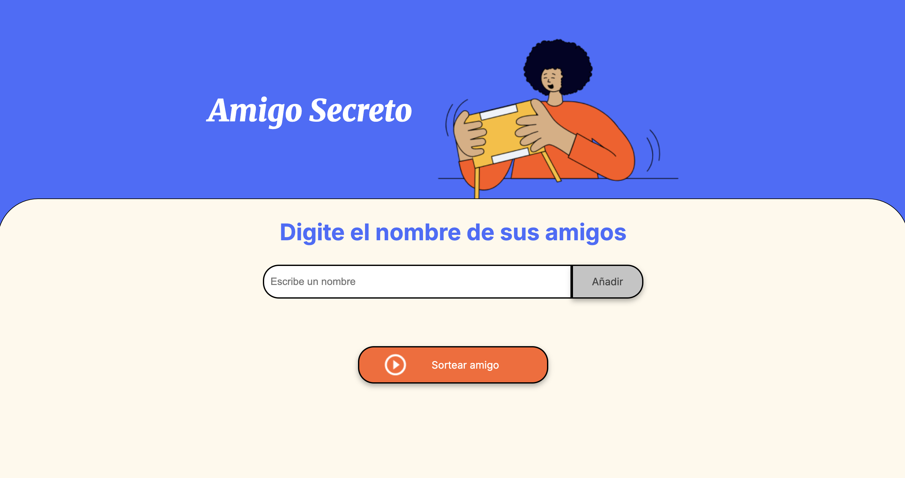

# 🎲 Challenge Amigo Secreto
Este proyecto forma parte de un reto de práctica para mejorar mi lógica de programación en JavaScript.
El código HTML y CSS fueron proporcionados, y yo trabajé únicamente en la parte de JavaScript para implementar la lógica del juego.

## 🚀 Funcionalidades
- Agregar nombres de amigos a una lista.
- Validar que el campo de entrada no esté vacío.
- Mostrar en pantalla la lista actualizada de amigos registrados.
- Sortear aleatoriamente un nombre de la lista.
- Reiniciar el juego para volver a empezar desde cero.

## 📂 Archivos principales
- `index.html` → Estructura base de la página.
- `style.css` → Estilos proporcionados para la interfaz.
- `app.js` → Archivo trabajado, contiene toda la lógica implementada en JavaScript.

## 🚀 Juega aquí
🔗 [Probar el juego](https://soykarencm.github.io/challenge-amigo-secreto-kc/)

## 📸 Vista previa

